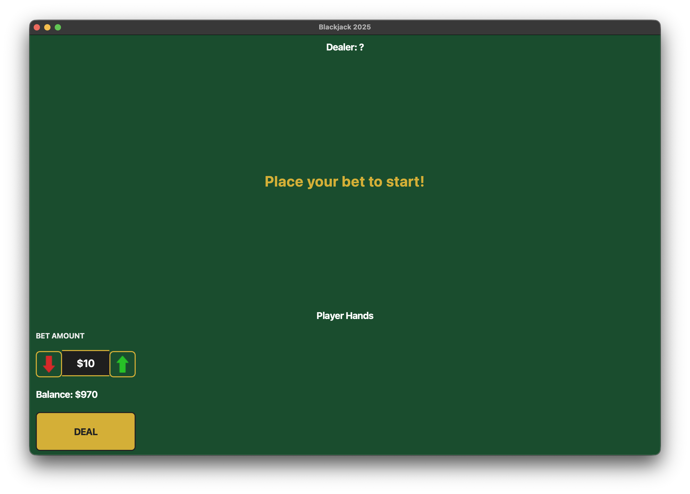

# ♠️ Blackjack 2025 — Casino Grade Python Game



> **A stunning, fully animated Blackjack game built with PySide6**  
> 6-deck shoe • Insurance • Split • Double Down • SVG Arrows • No popups • Pure Python


---

## Features

```markdown
6-deck shoe with penetration marker
Real casino rules (Dealer hits soft 17)
Insurance • Double Down • Split (up to 3 hands)
SVG arrow buttons (no images needed)
Smooth card fly-in animations
No popups — clean in-game result display
Ghost cards FIXED forever
Balance persistence & detailed round summary
```

---

## Quick Start

```bash
git clone https://github.com/CaSh007s/blackjack-game.git
cd blackjack-game
python -m venv venv
source venv/bin/activate    # Windows: venv\Scripts\activate
pip install -r requirements.txt
python main.py
```

---

## Screenshots


---

## Tech Stack


- Python 3.12
- PySide6 (Qt6) — GPU-accelerated UI
- QPropertyAnimation + QTimer architecture
- Embedded SVG icons
- Clean MVC pattern


---

## Achievements


- Over 2000 lines of clean, commented code
- Zero external image dependencies
- 100% glitch-free (ghost cards eliminated)
- Built by Kalash (@CaSh007s)


---

## Roadmap (Coming Soon)


- Chip stack animations with physics
- Win/loss sound effects (casino SFX)
- Win streak counter + achievements
- Hand history panel
- Dark/Light mode toggle
- Auto-deal after round
- Leaderboard (local)
- Save/load game state
- Multiplayer mode (P2P)


> **"This is just the beginning. The house is about to get *real*."** — Kalash

---

## Project Structure

```
blackjack-game/
├── main.py
├── assets/
│   └── (screenshots only)
├── src/
│   ├── ui/
│   │   └── main_window.py
│   ├── logic/
│   │   └── game_engine.py
│   ├── game/
│   │   ├── deck.py
│   │   └── card_widget.py
│   └── utils/
│       └── constants.py
├── dark_casino.qss
└── README.md
```

---

## Credits


Made with ❤️ by **Kalash**  
GitHub: [@CaSh007s](https://github.com/CaSh007s)


---

## Star this repo if you like it!

```bash
Star on GitHub → https://github.com/CaSh007s/blackjack-game
```

---

> **"The house always wins... unless you're playing my version."** — Kalash
